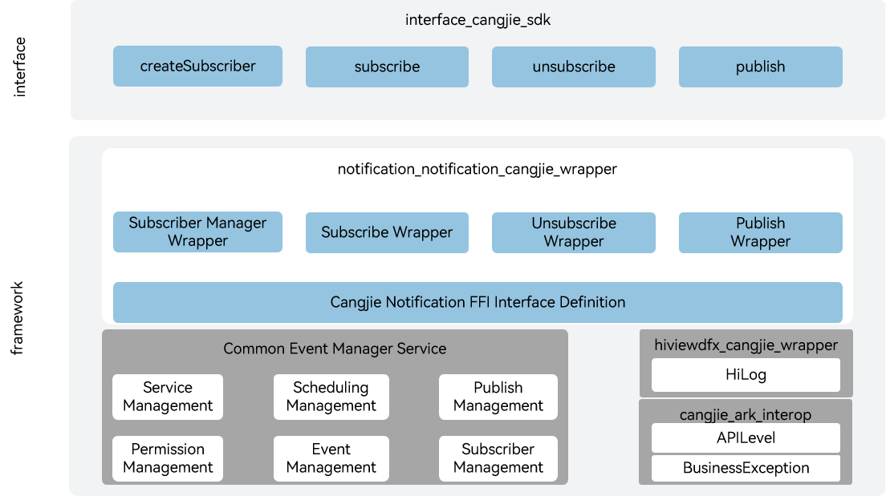

# notification_notification_cangjie_wrapper

## Introduction

The notification_notification_cangjie_wrapper is a Cangjie API encapsulated on OpenHarmony based on the capabilities of the notification subsystem. OpenHarmony provides a Common Event Service (CES) for applications to subscribe to, publish, and unsubscribe from common events. The currently open notification Cangjie API only supports standard devices.

Common events can be divided into system common events and custom common events.

- System common events: The system collects event information and sends it to user programs that have subscribed to the event according to system policies. For example: system events published by key system services, HAP installation, update, uninstallation, etc.

- Custom common events: Applications customize some common events to implement cross-application event communication capabilities.

Each application can subscribe to common events as needed. If an application subscribes successfully and the corresponding subscribed common event is published, the system will send it to the application. These common events may come from the system, other applications, and the application itself.

## System Architecture

**Figure 1** notification_cangjie_wrapper architecture



As shown in the architecture diagram, the notification Cangjie API provides the capabilities to publish common events, create subscribers, subscribe, and unsubscribe.

- Create Subscriber: Create a common event subscriber based on subscription information. The subscription information can specify the common events to subscribe to, the permissions required from the publisher, and set the subscriber's priority.
- Subscribe: Complete the subscription setting for the specified subscriber.
- Unsubscribe: Cancel the subscription capability of the specified subscriber.
- Publish: Publish a common event with the specified name and attributes.
- Cangjie Notification FFI Interface Definition: Responsible for defining C language interoperation Cangjie interfaces, used to implement Cangjie notification capabilities.
- Common Event Manager Service: Responsible for providing common event basic services, encapsulating C interfaces for interoperation with Cangjie.
- cangjie_ark_interop: Provides Cangjie annotation definitions for API annotation and BusinessException exception class definition for user-facing exceptions.
- hiviewdfx_cangjie_wrapper: Provides logging interfaces for printing logs on critical paths.

## Directory Structure

```
base/notification/notification_cangjie_wrapper
├── figures         # architecture pictures
└── ohos            # Cangjie notification interface implementation
│   ├── common_event_data           # Common event data module
│   ├── common_event_manager        # Common event management module
│   ├── common_event_publish_data   # Common event publish data module
│   ├── common_event_subscribe_info # Common event subscribe info module
│   ├── common_event_subscriber     # Common event subscriber module
│   └── value_type                  # Common event multi-value type implementation
└── test            # Cangjie notification test cases
    └── common_event_manager # Common event test cases
```

## Usage

The current notification Cangjie API provides the following functions:

- Publish common events.
- Create subscribers.
- Subscribe to common events.
- Unsubscribe.

Compared to ArkTS API, the following functions are not supported:

- The ability to send and process events between different threads within the same process or within the same thread.
- User notification service.

For common event related APIs, please refer to [ohos.common_event_manager](https://gitcode.com/openharmony-sig/arkcompiler_cangjie_ark_interop/blob/master/doc/API_Reference/source_en/apis/BasicServicesKit/cj-apis-common_event_manager.md). For related guidelines, please refer to [Common Event Development Guide](https://gitcode.com/openharmony-sig/arkcompiler_cangjie_ark_interop/tree/master/doc/Dev_Guide/source_en/basic-services/common-event).

## Code Contribution

Developers are welcome to contribute code, documentation, etc. For specific contribution processes and methods, please refer to [Code Contribution](https://gitcode.com/openharmony/docs/blob/master/en/contribute/code-contribution.md).

## Repositories Involved

[arkcompiler_cangjie_ark_interop](https://gitcode.com/openharmony-sig/arkcompiler_cangjie_ark_interop)

[hiviewdfx_hiviewdfx_cangjie_wrapper](https://gitcode.com/openharmony-sig/hiviewdfx_hiviewdfx_cangjie_wrapper)

[notification_common_event_service](https://gitcode.com/openharmony/notification_common_event_service)