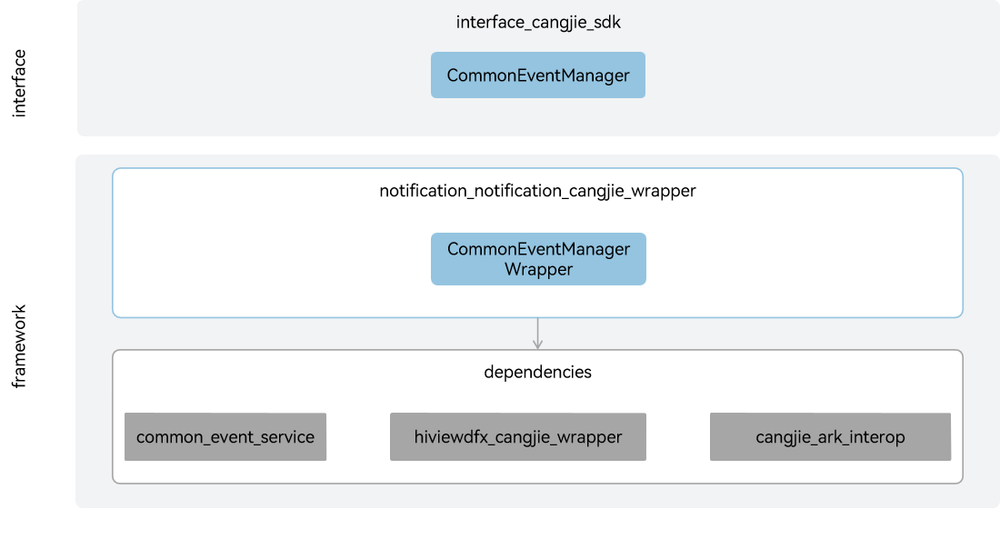

# notification_notification_cangjie_wrapper

## Introduction

The notification_notification_cangjie_wrapper is a Cangjie API encapsulated on OpenHarmony based on the capabilities of the Common Event Service (CES) Subsystem. OpenHarmony provides a CES for applications to subscribe to, publish, and unsubscribe from common events.

Common events in OpenHarmony are classified into system common events and custom common events.

- System common event: sent by the system based on system policies to the applications that have subscribed to the event. This type of event is typically system events published by key system services, such as HAP installation, update, and uninstallation.

- Custom common events: customized by applications to implement cross-application event communication.

Each application can subscribe to common events as required. After your application subscribes to a common event, the system sends it to your application every time the event is published. Such an event may be published by the system, other applications, or your own application.

**Figure 1** notification_cangjie_wrapper architecture



## Directory Structure

```cangjie
base/notification/notification_cangjie_wrapper
├── figures          # architecture pictures
└── ohos             # Cangjie Common Event Manager code
```

## Constaints

The currently open CommonEvent apis only support standard devices.

## Usage

The notification_notification_cangjie_wrapper provides interfaces for publishing public events, creating subscribers, subscribing, unsubscribing, etc.

A public event consists of two parts: an event of type string and options of type CommonEventPublishData. The event represents the name of the public event, and the options represent the attribute information of the public event.

The CommonEventSubscribeInfo type is for subscription information, used to create a public event subscriber, which can specify the public events the subscriber wants to subscribe to, the permissions required from the publisher, the subscriber's priority, and so on.

The CommonEventSubscriber is a public event subscriber used to obtain information about accepted public events and to set the processing information for public events.

For relevant API of CommonEventManager, please refer to [ohos.common_event_manager](https://gitcode.com/openharmony-sig/arkcompiler_cangjie_ark_interop/blob/master/doc/API_Reference/source_en/apis/BasicServicesKit/cj-apis-common_event_manager.md); for relevant guidelines, please refer to [CommonEvent Development Guide](https://gitcode.com/openharmony-sig/arkcompiler_cangjie_ark_interop/tree/master/doc/Dev_Guide/source_en/basic-services/common-event).

## Code Contribution

Developers are welcome to contribute code, documentation, etc. For specific contribution processes and methods, please refer to [Code Contribution](https://gitcode.com/openharmony/docs/blob/master/en/contribute/code-contribution.md).

## Repositories Involved

[notification_common_event_service](https://gitee.com/openharmony/notification_common_event_service/blob/master)
