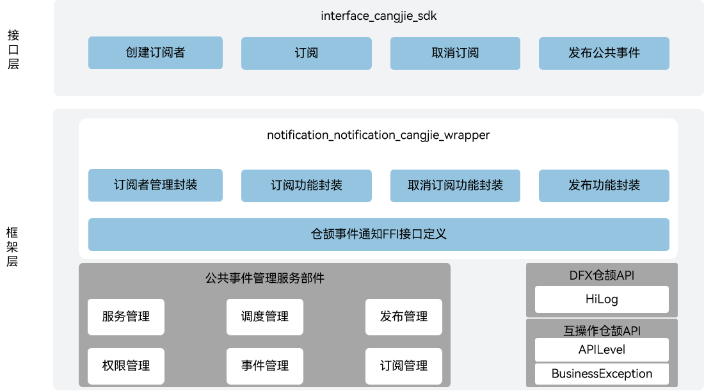

# 事件通知仓颉接口

## 简介

事件通知仓颉接口是在OpenHarmony上基于事件通知子系统能力之上封装的仓颉API。OpenHarmony通过CES（Common Event Service，公共事件服务）为应用程序提供订阅、发布、退订公共事件的能力。当前开放的事件通知仓颉接口仅支持standard设备。

公共事件可分为系统公共事件和自定义公共事件。

- 系统公共事件：系统将收集到的事件信息，根据系统策略发送给订阅该事件的用户程序。 例如：系统关键服务发布的系统事件, hap安装，更新，卸载等。

- 自定义公共事件：应用自定义一些公共事件用来实现跨应用的事件通信能力。

每个应用都可以按需订阅公共事件，若应用订阅成功且相应订阅的公共事件发布，系统会把其发送给应用。这些公共事件可能来自系统、其他应用和应用自身。

## 系统架构

**图 1** 事件通知仓颉架构图



如架构图所示，事件通知仓颉接口提供发布公共事件、创建订阅者、订阅、取消订阅的能力。

- 创建订阅者：根据订阅信息创建公共事件订阅者，其中订阅信息可以指定订阅的公共事件，要求发布者需要具备的权限，设定订阅者的优先级等。
- 订阅：完成指定订阅者的订阅设定。
- 取消订阅：取消指定订阅者的订阅能力。
- 发布公共事件：发布指定名称与属性的公共事件。
- 仓颉事件通知FFI接口定义：负责定义C语言互操作仓颉接口，用于实现仓颉事件通知能力。
- 公共事件管理服务：负责提供公共事件基础服务，封装C语言接口提供给仓颉进行互操作。

## 目录

```
base/notification/notification_cangjie_wrapper
├── figures         # 存放README中的架构图
└── ohos            # 仓颉事件通知接口实现
│   ├── common_event_data           # 公共事件数据模块
│   ├── common_event_manager        # 公共事件管理模块
│   ├── common_event_publish_data   # 公共事件发布数据模块
│   ├── common_event_subscribe_info # 公共事件订阅信息模块
│   ├── common_event_subscriber     # 公共事件订阅者模块
│   └── value_type                  # 公共事件多值类型实现
└── test            # 测试用例
    └── APILevel22
        └── common_event_manager # 公共事件测试用例
```

## 使用说明

当前事件通知仓颉接口提供以下功能：

- 发布公共事件。
- 创建订阅者。
- 订阅公共事件。
- 取消订阅。

与ArkTS提供的API能力相比，暂不支持以下功能：

- 在同一进程不同线程间或同一线程内发送和处理事件的能力。
- 用户通知服务。

事件通知相关接口请参见[公共事件API文档](https://gitcode.com/openharmony-sig/arkcompiler_cangjie_ark_interop/blob/master/doc/API_Reference/source_zh_cn/apis/BasicServicesKit/cj-apis-common_event_manager.md)，相关开发指导请参见[公共事件开发指南](https://gitcode.com/openharmony-sig/arkcompiler_cangjie_ark_interop/tree/master/doc/Dev_Guide/source_zh_cn/basic-services/common-event)。

## 参与贡献

欢迎广大开发者贡献代码、文档等，具体的贡献流程和方式请参见[参与贡献](https://gitcode.com/openharmony/docs/blob/master/zh-cn/contribute/%E5%8F%82%E4%B8%8E%E8%B4%A1%E7%8C%AE.md)。

## 相关仓

[arkcompiler_cangjie_ark_interop](https://gitcode.com/openharmony-sig/arkcompiler_cangjie_ark_interop)

[hiviewdfx_hiviewdfx_cangjie_wrapper](https://gitcode.com/openharmony-sig/hiviewdfx_hiviewdfx_cangjie_wrapper)

[notification_common_event_service](https://gitcode.com/openharmony/notification_common_event_service)
