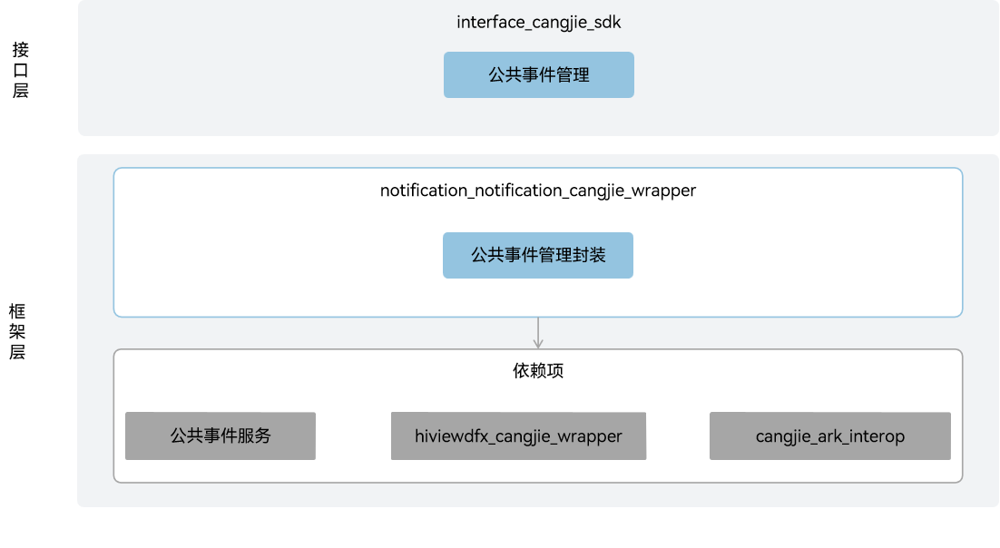

# 事件通知仓颉接口

## 简介

事件通知仓颉接口是在 OpenHarmony 上基于事件通知子系统能力之上封装的仓颉API。OpenHarmony通过CES（Common Event Service，公共事件服务）为应用程序提供订阅、发布、退订公共事件的能力。

公共事件可分为系统公共事件和自定义公共事件。

- 系统公共事件：系统将收集到的事件信息，根据系统策略发送给订阅该事件的用户程序。 例如：系统关键服务发布的系统事件（例如：hap安装，更新，卸载等）。

- 自定义公共事件：应用自定义一些公共事件用来实现跨应用的事件通信能力。

每个应用都可以按需订阅公共事件，订阅成功且公共事件发布，系统会把其发送给应用。这些公共事件可能来自系统、其他应用和应用自身。

**图 1** 事件通知仓颉架构图



## 目录

```cangjie
base/notification/notification_cangjie_wrapper
├── figures          # 存放readme中的架构图
└── ohos             # 仓颉事件通知接口实现
```

## 约束

当前开放的事件通知仓颉接口仅支持standard设备。

## 使用说明

如架构图所示，事件通知仓颉接口提供发布公共事件、创建订阅者、订阅、取消订阅的能力。

公共事件由String类型的event和CommonEventPublishData类型的options两部分组成，event表示公共事件的名称，options表示公共事件的属性信息。

CommonEventSubscribeInfo类型为订阅信息，用于创建公共事件订阅者，可以指定订阅者要订阅的公共事件，要求发布者需要具备的权限，订阅者的优先级等等。

CommonEventSubscriber类型为公共事件订阅者，用于获取所接受公共事件的相关信息，及设定公共事件的处理信息。

公共事件相关API请参见[ohos.common_event_manager](https://gitcode.com/openharmony-sig/arkcompiler_cangjie_ark_interop/blob/master/doc/API_Reference/source_zh_cn/apis/BasicServicesKit/cj-apis-common_event_manager.md)，相关指导请参见[公共事件开发指南](https://gitcode.com/openharmony-sig/arkcompiler_cangjie_ark_interop/tree/master/doc/Dev_Guide/source_zh_cn/basic-services/common-event)。

## 参与贡献

欢迎广大开发者贡献代码、文档等，具体的贡献流程和方式请参见[参与贡献](https://gitcode.com/openharmony/docs/blob/master/zh-cn/contribute/%E5%8F%82%E4%B8%8E%E8%B4%A1%E7%8C%AE.md)。

## 相关仓

[notification_common_event_service](https://gitee.com/openharmony/notification_common_event_service/blob/master/README_zh.md)
